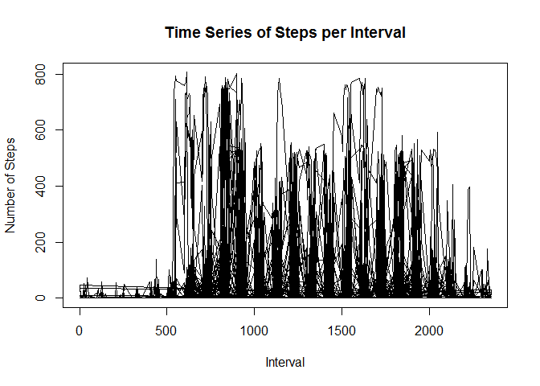
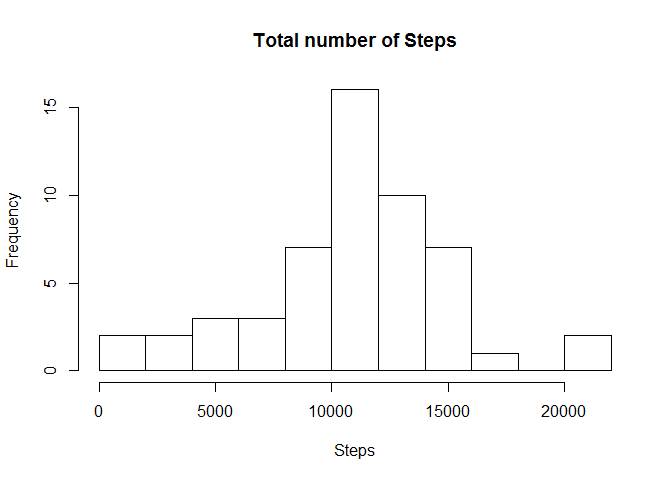
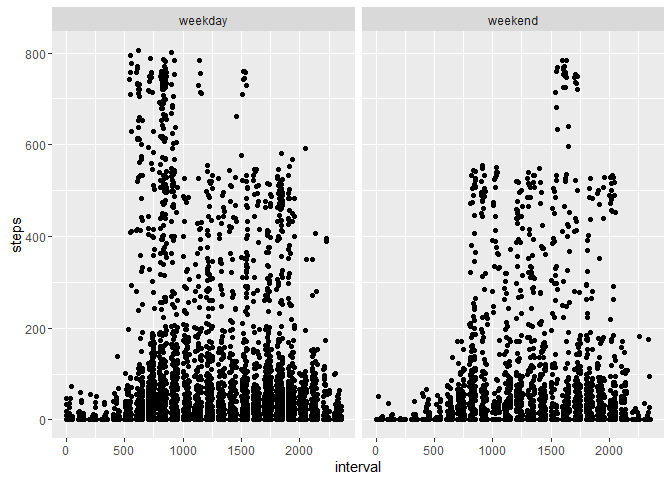

# Reproducible Research: Peer Assessment 1
Load packages necessary for the analysis

```r
library(dplyr)
```

```
## Warning: package 'dplyr' was built under R version 3.2.3
```

```
## 
## Attaching package: 'dplyr'
```

```
## The following objects are masked from 'package:stats':
## 
##     filter, lag
```

```
## The following objects are masked from 'package:base':
## 
##     intersect, setdiff, setequal, union
```

```r
library(data.table)
```

```
## 
## Attaching package: 'data.table'
```

```
## The following objects are masked from 'package:dplyr':
## 
##     between, last
```

```r
library(ggplot2)
```

```
## Warning: package 'ggplot2' was built under R version 3.2.3
```

[Load and preprocess the dataset, which is available [here].

```r
activity <- read.csv("~/ReproducibleData/RepData_PeerAssessment1/activity.csv")
act <- na.omit(activity) #Create second dataset with NA removed
View(activity)
View(act)
```

Calculate mean total number of steps taken per day:

```r
steps_daily <- aggregate(steps ~ date, data=act, sum)
mean(steps_daily$steps)
```

```
## [1] 10766.19
```

Determine average daily activity pattern:

```r
plot(act$interval, act$steps, type="l", xlab="Interval", ylab="Number of Steps", main="Time Series of Steps per Interval")
```

\

```r
dev.copy(png, 'Time Series Plot.png')
```

```
## png 
##   3
```

```r
dev.off()
```

```
## png 
##   2
```

Determine which 5-minute interval, on average across all the days in the dataset, contains the maximum number of steps:

```r
av_int <- tbl_df(act)
max(av_int$steps) #The number of steps is 806
```

```
## [1] 806
```

```r
av_int$interval[av_int$steps==806] #The interval is 615
```

```
## [1] 615
```

Imputing missing values -- *Reviewer please note:* The work below contains only a  partially complete assignment, as I was unable to finish parts two and three.

Determine total number of missing values in the dataset, i.e., total number of rows with NAs:

```r
sum(is.na(activity)) #There are 2304 total NA in the dataset
```

```
## [1] 2304
```

Make a histogram of total number of steps:

```r
ttl_steps <- with(activity, tapply(steps, date, sum))
hist(ttl_steps, breaks = 10, xlab="Steps", main="Total number of Steps")
```

\

```r
dev.copy(png, 'Histogram.png')
```

```
## png 
##   3
```

```r
dev.off()
```

```
## png 
##   2
```

Note differences in activity patterns between weekdays and weekends and create a new factor variable in the dataset with two levels for weekday and weekend:

```r
my_date <- as.Date(act$date)
weekend <- c("Saturday", "Sunday")
act$wkEnd <- factor((weekdays(my_date) %in% weekend),
levels=c(FALSE, TRUE), labels=c("weekday", "weekend"))
```

Make a panel plot containing a time series plot (type="l") of the 5-minute interval (x-axis) and the average number of steps taken, averaged across all weekday and weekend days (y-axis):

```r
weeklySteps <- ggplot(act, aes(interval, steps)) + geom_point()
weeklySteps + facet_grid(.~wkEnd)
```

\

```r
dev.copy(png, 'Panel Plot.png')
```

```
## png 
##   3
```

```r
dev.off()
```

```
## png 
##   2
```

[here]:  https://d396qusza40orc.cloudfront.net/repdata%2Fdata%2Factivity.zip
